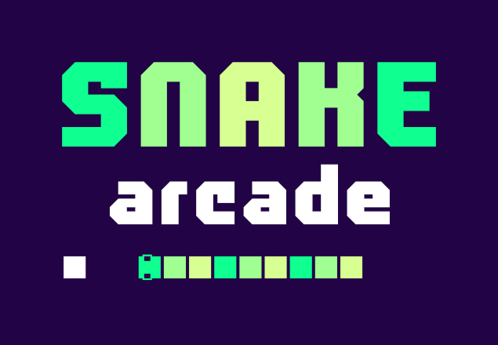
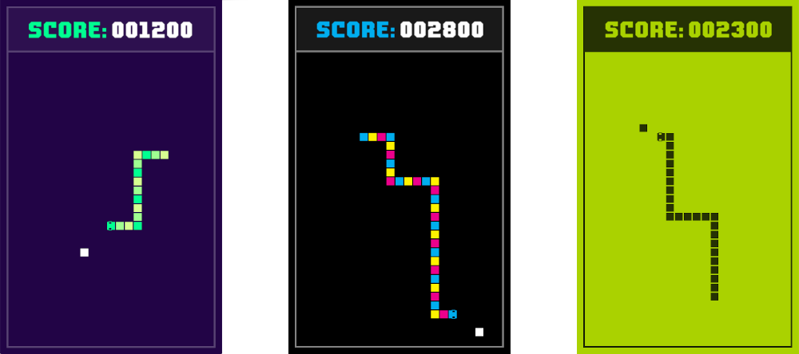

# Snake Arcade

Snake Arcade is a 2D [Snake game](https://en.wikipedia.org/wiki/Snake_(video_game_genre)) written in
[Python](https://www.python.org/) using [The Python Arcade library](https://github.com/pvcraven/arcade).



## Why another Snake game?

Coding a snake game felt like a rite of passage and, being a retro gamer at
heart, I decided to made this one of my "learn programming" projects.

I also wanted to make an easily extensible snake game available for the
excellent Python Arcade Library. Enjoy!

## Features

* Adjustable snake speed (in game/main menu)
* Colour themes, switchable anywhere in the application
* Pauseable gameplay

## How To Play

Guide the self-moving snake to food. When the snake eats it grows in length and
speeds up if enough points have been accumulated. Avoid fatal collisions with
border walls and the snake's own body.

### Controls

* ```Arrows``` - Change direction
* ```S``` - Increase speed
* ```D``` - Decrease speed
* ```P``` - Pause/resume gameplay
* ```T``` - Next colour theme

### Scoring System

* Food = 100 points
* Every 500 points the snakes minimum speed is increased

## Screenshots



## Roadmap

* Basic Sounds
* Better instructions
* More light themes
* Modes: Easy/Normal/Hard
* Joystick support
* Fullscreen support

## Wishlist

* Combo points - Eat the next piece of food using the least possible moves for
  combo points
* Trail points -  Paint the game board squares as the snakes moves for bonus points
* Poison food - Reverse the snake direction on each input for a short period

## Status

Snake Arcade is under occasional development. I've shifted focus to front-end
web work but chip away at this when possible, to improve my Python skills. If
you would like to get involved, please see
[Contributing to Snake Arcade](https://github.com/nigel-maher/snake-arcade/blob/master/CONTRIBUTING.md) and the
[Contributor Covenant Code of Conduct](https://github.com/nigel-maher/snake-arcade/blob/master/CODE_OF_CONDUCT.md#contributor-covenant-code-of-conduct).

## Credits

Snake Arcade uses the [ProLamina 2](https://www.dafont.com/prolamina-2.font)
font.

## License

Snake Arcade is released under the GNU GPLv3 license.
